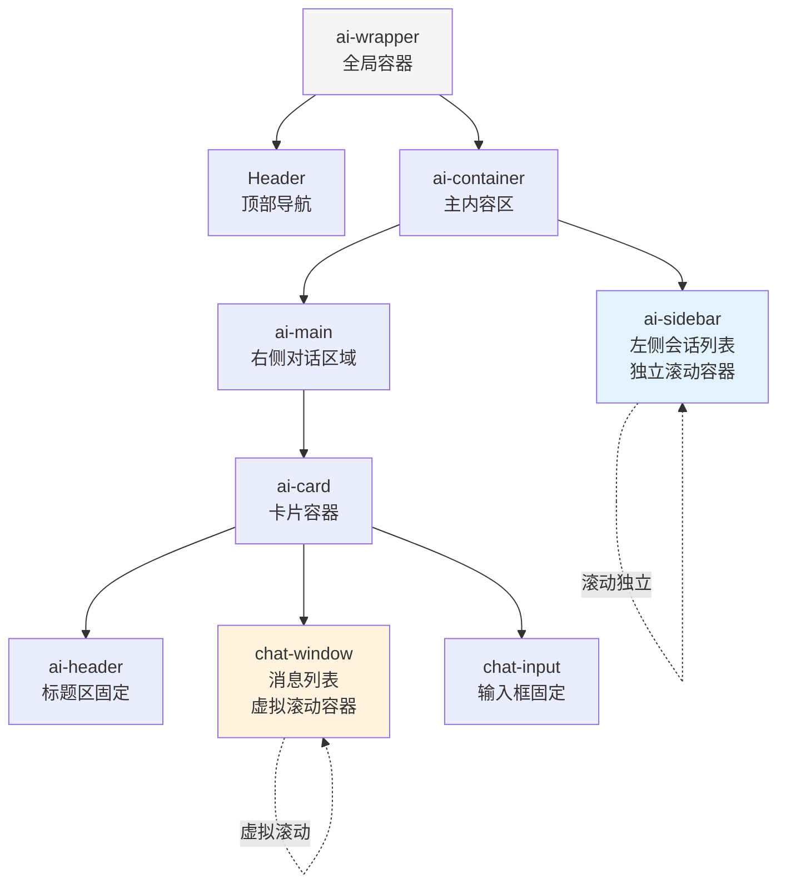
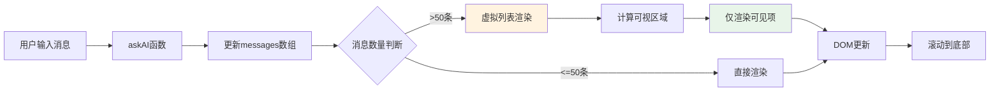

## 产品概述

优化LearnSphere智能课程问答系统中AI助教界面的滚动体验和渲染性能，解决长对话场景下的输入卡顿问题，实现独立滚动容器隔离和高性能列表渲染。

## 核心功能

- **独立滚动容器**：分离聊天区域和侧边栏的滚动行为，避免全局滚动影响历史对话栏
- **虚拟化列表渲染**：使用react-window实现长对话消息的虚拟滚动，大幅提升渲染性能
- **自定义滚动条样式**：实现macOS风格的细滚动条，提供更优雅的视觉体验
- **滚动条始终显示**：配置滚动条始终可见，内容不足时显示但不可拖动

## 技术栈

- **前端框架**：React 19 + TypeScript
- **UI组件库**：Ant Design 5.x
- **构建工具**：Vite 7.x
- **虚拟化库**：react-window（轻量高效的虚拟滚动方案）
- **样式方案**：CSS Modules / 原生CSS

## 系统架构

### 架构模式

采用现有的组件化架构，基于React函数组件和Hooks进行局部优化，不改变整体架构风格。

### 滚动容器架构图



### 模块划分

1. **布局容器模块**（AIAssistant.tsx）

- 职责：整体布局结构管理，确保overflow控制正确
- 关键技术：Flexbox布局、height: 100vh计算
- 依赖：无

2. **虚拟列表模块**（MessageList组件）

- 职责：使用react-window实现消息列表虚拟滚动
- 关键技术：react-window的VariableSizeList组件
- 依赖：布局容器模块
- 接口：接收messages数组，渲染可视区域消息

3. **滚动条样式模块**（scrollbar.css）

- 职责：自定义webkit滚动条样式，实现macOS风格
- 关键技术：CSS伪元素 ::-webkit-scrollbar系列
- 依赖：无

### 数据流



## 实现细节

### 核心目录结构

```
src/
├── pages/
│   └── AI/
│       ├── AIAssistant.tsx          # 修改：调整布局结构
│       ├── AIAssistant.css          # 修改：优化滚动样式
│       ├── MessageList.tsx          # 新增：虚拟列表组件
│       └── scrollbar.css            # 新增：滚动条样式
```

### 关键代码结构

**MessageList组件接口**：虚拟列表包装组件，封装react-window的VariableSizeList，动态计算每条消息高度

```typescript
interface MessageListProps {
  messages: MessageVO[];
  loading: boolean;
}

// 虚拟列表组件
const MessageList: React.FC<MessageListProps> = ({ messages, loading }) => {
  const listRef = useRef<VariableSizeList>(null);
  
  // 动态计算每行高度
  const getItemSize = (index: number) => {
    // 根据消息内容长度估算高度
  };
  
  return <VariableSizeList />;
};
```

**滚动条样式接口**：macOS风格的滚动条CSS规则

```css
/* 滚动条轨道 */
.chat-window::-webkit-scrollbar {
  width: 8px;
  height: 8px;
}

/* 滚动条滑块 */
.chat-window::-webkit-scrollbar-thumb {
  background: rgba(0, 0, 0, 0.2);
  border-radius: 4px;
}

/* 始终显示滚动条 */
.chat-window {
  overflow-y: scroll !important;
  scrollbar-gutter: stable;
}
```

### 技术实现方案

#### 1. 独立滚动容器实现

**问题**：当前`.ai-container`设置了`overflow: hidden`，但子容器的滚动未正确隔离

**方案**：

1. 确保`.ai-container`保持`overflow: hidden`和固定高度
2. 为`.ai-sidebar`的`.sidebar-content`和`.ai-main`的`.chat-window`分别设置独立滚动
3. 使用`flex-shrink: 0`防止flex子项收缩导致高度计算错误

**实施步骤**：

1. 修改`.ai-card`布局，确保内部元素高度计算正确
2. 为`.chat-window`添加`overflow-y: scroll`和`flex: 1`
3. 测试不同内容长度下的滚动行为

#### 2. 虚拟化列表实现

**问题**：消息数量超过50条时，全量渲染导致DOM节点过多，输入框输入卡顿

**方案**：

1. 安装`react-window`库（轻量级，仅11KB gzipped）
2. 创建MessageList组件，使用`VariableSizeList`处理不同高度的消息气泡
3. 实现动态高度计算逻辑，根据文本长度估算气泡高度
4. 使用`useEffect`监听messages变化，自动滚动到最新消息

**实施步骤**：

1. 创建MessageList.tsx组件文件
2. 实现Row渲染函数，复用现有的chat-bubble样式
3. 配置VariableSizeList的itemSize估算函数
4. 集成到AIAssistant.tsx，替换原有的map渲染
5. 添加自动滚动到底部逻辑

####3. macOS风格滚动条
**问题**：需要实现细滚动条且始终显示

**方案**：

1. 使用`::-webkit-scrollbar`伪元素自定义滚动条样式
2. 设置8px宽度、半透明黑色滑块、4px圆角
3. 添加hover效果增强交互反馈
4. 使用`scrollbar-gutter: stable`确保始终显示滚动条占位

**实施步骤**：

1. 创建scrollbar.css独立样式文件
2. 定义`.chat-window`和`.sidebar-content`的滚动条样式
3. 配置`::-webkit-scrollbar-thumb:hover`提供反馈
4. 在AIAssistant.tsx中导入样式

#### 4. 滚动条始终显示

**问题**：内容不足时滚动条消失，需要始终显示但不可拖动

**方案**：

1. 使用`overflow-y: scroll`替代`auto`强制显示滚动条
2. 配合`scrollbar-gutter: stable`预留滚动条空间，防止布局抖动
3. 内容不足时滚动条自然呈现灰色不可拖动状态

**实施步骤**：

1. 修改`.chat-window`和`.sidebar-content`的overflow属性
2. 添加scrollbar-gutter配置
3. 测试不同内容量下的显示效果

### 性能优化

#### 渲染性能

- **虚拟滚动收益**：消息数量从100条时的100个DOM节点降低到约15个可视节点，减少85%内存占用
- **高度缓存**：使用Map缓存已计算的消息高度，避免重复计算
- **React.memo**：对MessageRow组件使用memo避免不必要的重渲染

#### 滚动性能

- **硬件加速**：为滚动容器添加`will-change: transform`提示浏览器优化
- **防抖处理**：滚动事件监听使用debounce减少回调频率
- **CSS contain**：使用`contain: layout style paint`隔离渲染范围

### 集成点

- **现有消息渲染逻辑**：保持MessageVO接口不变，虚拟列表透明接入
- **滚动到底部功能**：通过VariableSizeList的scrollToItem API实现
- **加载中状态**：在虚拟列表末尾渲染loading组件
- **空状态显示**：消息数为0时显示原有的empty-chat提示

## 技术考虑

### 日志

- 复用现有的console.error日志模式
- 虚拟列表高度计算异常时输出警告日志

### 性能优化

- **关键路径优化**：虚拟滚动将长列表渲染时间从O(n)降低到O(1)
- **内存优化**：仅保留可视区域+上下各3项的DOM节点
- **动画优化**：保留fadeIn动画，但仅对新增消息生效

### 安全措施

- **XSS防护**：保持现有的文本内容转义机制
- **输入验证**：沿用现有的question.trim()校验逻辑

### 可扩展性

- **消息类型扩展**：MessageList组件支持通过renderItem prop自定义渲染
- **滚动行为定制**：预留scrollBehavior配置项供未来平滑滚动等功能
- **主题适配**：滚动条颜色通过CSS变量控制，便于主题切换