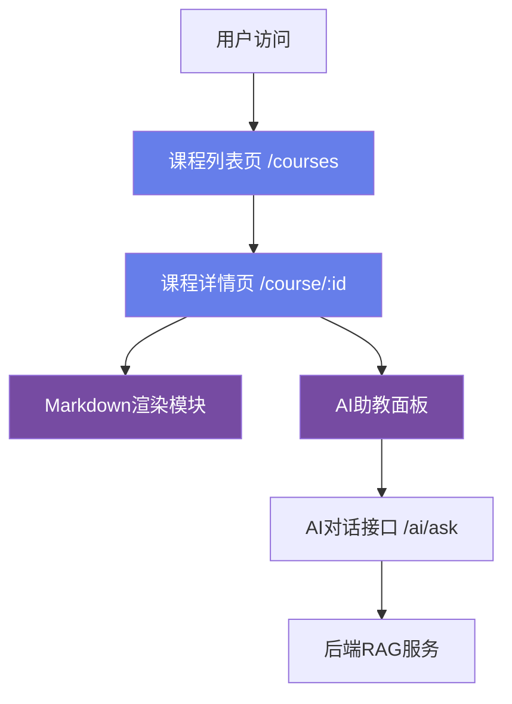

## 产品概述

LearnSphere课程展示系统，为用户提供完整的课程浏览、筛选和学习体验。系统包含课程列表展示、课程内容学习和智能AI助教辅导三大核心功能模块。

## 核心功能

### 课程列表页

- 使用现代化卡片布局展示课程列表，每个课程卡片包含标题、描述、标签和时间信息
- 提供时间排序和标签筛选功能的UI界面（筛选器面板位于页面顶部，包含时间排序按钮组和标签多选框）
- 支持点击课程卡片进入详情页，提供流畅的导航体验
- 采用响应式网格布局，适配不同屏幕尺寸

### 课程详情页

- 默认全屏显示Markdown格式的课程内容，提供清晰的文档阅读体验
- 右下角固定悬浮AI助教按钮（紫色渐变背景，带图标提示）
- 点击AI按钮后，页面切换为左右双栏布局：左侧70%显示课程内容，右侧30%显示AI对话面板
- 支持再次点击按钮收起AI面板，恢复全屏阅读模式
- Markdown内容支持标题、列表、代码块、引用等常见格式渲染

### AI助教对话

- 在课程详情页右侧面板中嵌入AI对话功能
- 对话界面保持与独立AI助教页面一致的视觉风格（紫色渐变主题）
- 每次对话请求自动携带当前课程ID，支持后端RAG检索课程相关知识
- 消息显示区域采用虚拟滚动优化性能，输入框固定在底部
- 对话历史与课程关联，切换课程时自动清空对话

## 技术栈

### 前端框架与工具

- **核心框架**: React 19.2 + TypeScript 5.9
- **构建工具**: Vite 7.2
- **路由管理**: React Router DOM 6.28
- **UI组件库**: Ant Design 5.20
- **HTTP请求**: Axios 1.7
- **Markdown渲染**: react-markdown（需新增）
- **代码高亮**: react-syntax-highlighter（需新增）

### 技术架构

#### 系统架构



#### 模块划分

**课程列表模块**

- 职责：展示课程列表、提供筛选UI、处理课程导航
- 核心技术：React Hooks（useState, useEffect）、Ant Design（Card, Select, Button）
- 依赖：request API模块、Course类型定义
- 接口：暂时使用mock数据，未来对接`/course/list`接口

**课程详情模块**

- 职责：渲染Markdown课程内容、管理AI面板显示状态、协调布局切换
- 核心技术：react-markdown、react-syntax-highlighter、动态CSS布局
- 依赖：路由参数（courseId）、Markdown渲染库
- 接口：暂时使用mock数据，未来对接`/course/detail/:id`接口

**AI对话集成模块**

- 职责：在课程详情页内嵌AI对话功能、管理对话状态、传递课程上下文
- 核心技术：复用现有AIAssistant组件逻辑、Context共享状态
- 依赖：`/ai/ask`接口、MessageList虚拟滚动组件
- 接口：`POST /ai/ask`，请求体增加`courseId`字段

#### 数据流

```mermaid
flowchart LR
    A[用户浏览课程列表] --> B[选择课程]
    B --> C[加载课程详情]
    C --> D[渲染Markdown内容]
    D --> E[用户点击AI按钮]
    E --> F[切换双栏布局]
    F --> G[显示AI对话面板]
    G --> H[用户发送问题+courseId]
    H --> I[调用/ai/ask接口]
    I --> J[后端RAG检索]
    J --> K[返回AI回答]
    K --> L[显示在对话区域]
```



## 实现细节

### 核心目录结构

```
src/
├── pages/
│   └── Course/
│       ├── CourseList.tsx          # 已存在，需扩展
│       ├── CourseDetail.tsx        # 新增：课程详情页
│       ├── CourseDetail.css        # 新增：详情页样式
│       └── AIPanel.tsx             # 新增：AI对话面板组件
├── types/
│   └── api.ts                      # 扩展Course接口
└── router/
    └── index.tsx                   # 新增课程详情路由
```

### 关键代码结构

**扩展Course接口** - 添加课程完整信息字段，支持标签、时间和内容存储

```typescript
export interface Course {
  id: number;
  title: string;
  description: string;
  tags: string;              // 新增：逗号分隔的标签，如"前端,React"
  createTime: string;        // 新增：创建时间
  updateTime: string;        // 新增：更新时间
  content: string;           // 新增：Markdown格式的课程内容
}
```

**扩展ChatRequest接口** - 在AI对话请求中添加课程上下文

```typescript
export interface ChatRequest {
  question: string;
  sessionId: string;
  courseId?: number;         // 新增：课程ID，用于RAG检索
}
```

**CourseDetail组件状态** - 管理AI面板显示和布局模式

```typescript
interface CourseDetailState {
  course: Course | null;
  aiPanelVisible: boolean;   // AI面板是否显示
  messages: MessageVO[];     // AI对话消息列表
  loading: boolean;          // 数据加载状态
}
```

### 技术实现方案

#### Markdown渲染实现

1. **问题陈述**: 需要在React中渲染Markdown格式的课程内容，支持代码高亮、列表、表格等常见语法
2. **解决方案**: 使用react-markdown库配合react-syntax-highlighter进行语法高亮
3. **关键技术**: 

- `react-markdown`: 核心Markdown渲染库
- `react-syntax-highlighter`: 代码块高亮
- `remark-gfm`: 支持GitHub风格Markdown扩展语法

4. **实现步骤**:

- 安装依赖：`npm install react-markdown react-syntax-highlighter remark-gfm`
- 配置Markdown组件自定义渲染器
- 为代码块配置语法高亮主题
- 添加自定义样式优化阅读体验

5. **测试策略**: 准备包含标题、列表、代码块、表格的mock Markdown内容进行渲染测试

#### 动态布局切换实现

1. **问题陈述**: 需要在全屏和双栏模式之间平滑切换，不影响用户阅读体验
2. **解决方案**: 使用CSS Flexbox布局 + React状态控制宽度百分比
3. **关键技术**: CSS transitions、条件渲染、Flexbox布局
4. **实现步骤**:

- 创建布局容器，使用flex布局
- 通过状态控制Markdown区域宽度（100% ↔ 70%）
- 添加CSS transition实现平滑过渡动画
- 固定定位AI助教按钮在右下角
- 条件渲染AI面板组件

5. **测试策略**: 测试多次切换的流畅性、响应式适配、动画效果

#### AI对话集成实现

1. **问题陈述**: 需要在课程详情页中复用AI助教功能，并自动携带课程上下文
2. **解决方案**: 提取AIAssistant核心对话逻辑为独立组件，通过props传递courseId
3. **关键技术**: 组件抽象、props传递、接口参数扩展
4. **实现步骤**:

- 创建AIPanel组件，封装对话UI和逻辑
- 复用MessageList虚拟滚动组件
- 在ChatRequest中添加courseId字段
- 发送消息时自动注入当前课程ID
- 保持与独立AI助教页面一致的样式

5. **测试策略**: 验证courseId正确传递、对话功能正常、样式一致性

#### Mock数据管理

1. **问题陈述**: 在后端接口未完成前，需要提供完整的mock数据支持功能开发和测试
2. **解决方案**: 在组件内部创建mock数据常量，模拟真实数据结构
3. **关键技术**: TypeScript类型约束、本地数据管理
4. **实现步骤**:

- 创建包含5-6门课程的mock数据数组
- 每门课程包含完整字段（tags、时间、Markdown内容）
- Markdown内容包含多种语法元素用于测试渲染
- 使用数组find方法模拟详情查询
- 保留接口调用代码（注释状态），便于后续对接

5. **测试策略**: 验证数据结构完整性、类型正确性、渲染效果

### 集成点说明

**路由集成**

- 在`src/router/index.tsx`中新增路由：`{ path: "/course/:id", element: <CourseDetail /> }`
- 课程列表使用`<Link to={`/course/${course.id}`}>`进行导航
- 课程详情使用`useParams()`获取路由参数中的courseId

**组件复用**

- 复用Header组件作为导航栏
- 复用MessageList组件实现AI对话虚拟滚动
- 复用现有的request API工具
- 复用AIAssistant的消息气泡样式

**API接口**

- 复用`POST /ai/ask`接口，扩展请求参数支持courseId
- 未来对接`GET /course/list`获取课程列表
- 未来对接`GET /course/detail/:id`获取课程详情

## 技术考量

### 日志记录

- 遵循项目现有的console.error日志模式
- 在数据加载失败、接口调用异常时输出错误日志
- 使用Ant Design的message组件向用户展示友好提示

### 性能优化

- **虚拟滚动**: 复用MessageList组件的react-window虚拟滚动，优化长对话列表渲染
- **懒加载**: 课程详情页按需加载Markdown内容，避免列表页加载过多数据
- **代码分割**: 利用React Router的路由级代码分割，减少初始加载体积
- **缓存策略**: 使用React状态缓存已加载的课程详情，避免重复请求

### 安全措施

- 复用项目现有的request拦截器处理身份认证
- Markdown渲染时使用react-markdown的安全模式，防止XSS攻击
- 用户输入内容在发送到AI接口前进行trim处理

### 可扩展性

- 组件化设计：AIPanel、CourseCard等可独立复用
- 接口预留：mock数据与真实接口调用代码分离，便于后续对接
- 样式解耦：使用独立CSS文件，便于主题定制
- 类型系统：完善的TypeScript类型定义，便于功能扩展

## 设计风格

采用现代极简风格，延续LearnSphere现有的紫色渐变主题（#667eea到#764ba2），打造统一、专业的学习平台体验。

### 课程列表页设计

**顶部筛选区域**

- 使用白色卡片容器，带轻微阴影和圆角，与页面背景（#f7f8fb）形成层次对比
- 筛选器横向排列：左侧时间排序按钮组（最新、最早），右侧标签多选下拉框，使用Ant Design的Radio.Group和Select组件
- 筛选器高度适中（60px），提供舒适的交互区域

**课程卡片网格**

- 响应式网格布局：PC端3列、平板2列、移动端1列，卡片间距20px
- 每个卡片包含：顶部渐变色条（紫色系）、课程标题（加粗18px）、描述文本（灰色14px）、底部标签栏（浅灰背景、圆角标签）和时间戳（右下角小字）
- 卡片悬停效果：轻微上浮（translateY -4px）+ 阴影加深，transition 0.3s
- 卡片圆角12px，白色背景，阴影0 2px 12px rgba(0,0,0,0.08)

### 课程详情页设计

**全屏模式布局**

- Markdown内容区域居中显示，最大宽度1000px，两侧留白，背景纯白
- 内容区域padding 40px，提供充足阅读空间
- 右下角固定悬浮AI按钮：圆形（直径56px），紫色渐变背景，白色机器人图标，阴影效果，悬停时放大1.1倍

**双栏模式布局**

- 左侧Markdown区域：宽度70%，保持白色背景，轻微右侧边框分隔
- 右侧AI面板：宽度30%，背景#fafbff，完整嵌入对话界面
- 布局切换动画：0.4s ease-out，平滑过渡宽度变化

**Markdown样式**

- 标题：渐变色文字（h1: 32px 600，h2: 24px 600，h3: 20px 600）
- 正文：16px行高1.8，颜色#2d3748，段落间距16px
- 代码块：深色背景（#282c34），浅色文字，左侧彩色边框，圆角8px
- 引用块：左侧紫色竖条，浅灰背景，斜体文字
- 列表：圆形标记，缩进适中，行间距1.6

**AI对话面板**

- 顶部标题栏：显示"课程AI助教"，紫色渐变文字，高度60px
- 消息区域：占据中间flex空间，白色气泡样式，与独立AI助教页面保持一致
- 底部输入框：固定底部，白色背景，上边框分隔，紫色发送按钮

### 交互动效

- 卡片悬停：上浮 + 阴影过渡
- AI按钮：悬停放大 + 旋转微动效
- 布局切换：平滑宽度动画
- 消息发送：淡入 + 上滑动画（复用现有AIAssistant动效）
- 标签选择：高亮 + 边框颜色渐变

### 响应式适配

- **PC端（>1200px）**: 课程3列网格，双栏比例70/30
- **平板端（768-1200px）**: 课程2列网格，双栏比例60/40
- **移动端（<768px）**: 课程1列，AI面板全屏覆盖（抽屉模式）